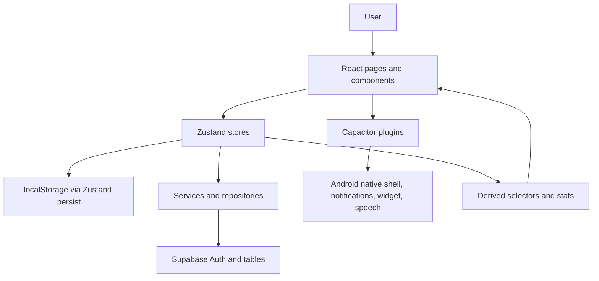

# Forge AI Application Documentation

Authoritative reference for product stakeholders, end users, and developers.

Last reviewed against source: 21 May 2026.

## 1. Application Overview

### Purpose

Forge AI is a mobile-first personal operating system for students and self-improvement users who want daily structure without maintaining a traditional to-do list. It combines missions, habits, challenge programs, mood check-ins, progress analytics, focus timers, voice capture, and gamified XP into one routine-management app.

The product language is intentionally tactical: "Mission", "Deploy", "Daily Ops", "Intel", "Programs", and "Sync" are used across the UI to make daily execution feel active and concrete.

### Primary Use Case

The current product is optimized for a 20-22 year old CS student preparing for placements while trying to stay consistent with coding practice, gym, health, college work, and mental discipline. The app helps the user answer:

- What should I do today?
- What is already done?
- Which programs am I committed to?
- How consistent have I been?
- How am I showing up emotionally today?
- Can I convert a thought or spoken idea into a mission quickly?

### Target Users

- Primary: CS students preparing for placements, DSA, LeetCode, and interviews.
- Secondary: self-improvement users following multi-day fitness, study, or habit programs.
- Internal users: the developer/operator maintaining a single-user Android app and validating product-market fit.
- Stakeholders: reviewers, launch decision-makers, and potential early users evaluating readiness.

### Core Value Proposition

Forge AI turns goals into daily operational structure. Instead of asking users to repeatedly plan from scratch, it lets them activate programs that inject daily habits, complete missions for XP, track streaks, check mood, and view progress in one mobile workflow.

### Business Objectives

- Ship a polished Android-first productivity app before Play Store launch.
- Differentiate from generic habit trackers through placement-prep programs, mood-driven daily framing, and tactical UX language.
- Support early distribution to a college batch with concrete LeetCode, DSA, gym, and routine workflows.
- Keep the technical foundation simple: local-first Zustand stores, Supabase for auth/profile/sync, Capacitor for Android capabilities.

## 2. Feature Documentation

### Feature Status Legend

- Core: part of the primary app loop and visible in main navigation.
- Secondary: implemented or partially available outside the core loop.
- Experimental: exists in code but is incomplete, legacy, or not fully aligned with the current Forge AI product direction.
- Roadmap: planned but not implemented as a production feature.

### Current Feature Inventory

| Feature | Status | Main Files | Summary |
| --- | --- | --- | --- |
| Google authentication | Core | `src/pages/AuthPage.tsx`, `src/store/useAppStore.ts` | Signs in with Google, exchanges ID token with Supabase, creates/fetches profile, gates app routes. |
| Onboarding | Core | `src/pages/OnboardingPage.tsx` | Three-step setup: name/goal, program selection, wake/study schedule, then deploys selected programs. |
| Daily Command Center | Core | `src/pages/HomePage.tsx` | Main dashboard with greeting, XP, streak, mood check, Daily Ops, active programs, motivation, journal/progress links. |
| Daily Ops | Core | `src/pages/HomePage.tsx`, `src/components/OpsWidget.tsx` | Combines checkbox habits and active missions into a time-sorted daily action list. |
| Missions / Kanban | Core | `src/pages/TasksPage.tsx`, `src/components/tasks/KanbanBoard.tsx` | Task board with backlog, this week, today, in progress, completed; supports filters, creation, details, drag/drop moves. |
| Program activation | Core | `src/pages/ProgramsPage.tsx`, `src/store/useProgramStore.ts`, `src/lib/programs.ts` | Activates built-in or custom programs and injects their daily requirements into habits. |
| Built-in placement programs | Core | `src/lib/programs.ts` | LeetCode 75, Gym Progress, LeetCode 150, DSA Sheet, Core Subjects. |
| Mood Check | Core | `src/components/MoodCheck.tsx`, `src/lib/moodContent.ts`, `src/store/useHabitStore.ts` | Daily mood selection with five tactical mood states and 30-day chart support. |
| Daily Motivation | Core | `src/components/MotivationCard.tsx`, `src/lib/motivationCards.ts` | Day-of-year rotated motivational cards; streak cards override when streak exists. |
| XP and levels | Core | `src/store/useHabitStore.ts`, `src/pages/StatsPage.tsx`, `src/pages/ProfilePage.tsx` | Habit completion gives 10 XP, mission completion gives 25 XP, program daily requirement gives 20 XP. |
| Streak shields | Core | `src/store/useHabitStore.ts`, `src/pages/HomePage.tsx`, `src/pages/StatsPage.tsx` | Earned every 7 consistency days, capped at 3. |
| Stats dashboard | Core | `src/pages/StatsPage.tsx` | XP level, tactical/strategic/future mission counts, habit completion, mood chart, mission breakdown. |
| Profile | Core | `src/pages/ProfilePage.tsx` | User identity, XP level, habit completions, streaks, active programs, local data status, logout. |
| Schedule/history | Secondary | `src/pages/SchedulePage.tsx`, `src/services/scheduleService.ts` | Calendar, habit history per selected day, scheduled items list, add schedule modal. |
| Journal | Secondary | `src/pages/JournalPage.tsx` | Daily mood, feelings, reasons, note, and progress companion view. |
| Progress map | Secondary | `src/pages/ProgressPage.tsx`, `src/lib/progress.ts` | 30-day completion map, streak stats, total completions, daily status signal. |
| Voice to mission | Secondary | `src/pages/VoicePage.tsx` | Native or browser speech recognition; transcript can prefill a new mission. |
| Local notifications | Secondary | `src/App.tsx`, `src/components/OpsWidget.tsx` | Requests notification permission, creates Android notification channel, arms reminders for timed Daily Ops. |
| Android home-screen widget | Secondary | `src/services/widgetBridge.ts`, `android/app/src/main/java/com/hundreddays/app/*` | Writes top Daily Ops to native SharedPreferences and consumes completed widget item IDs. |
| Pomodoro / Deep Work | Experimental | `src/pages/PomodoroPage.tsx`, `src/store/useTimerStore.ts` | Timer sessions, mode selector, focus overlay, local session history. Some colors and repository stubs need alignment. |
| Blitz Focus | Experimental | `src/pages/BlitzFocusPage.tsx`, `src/store/useBlitzStore.ts` | Task-focused countdown mode backed by a secondary task store. Not part of main nav. |
| Legacy challenge dashboards and hubs | Experimental | `src/components/Challenge*`, `src/components/Hubs/*`, `src/hooks/useChallenges.ts` | Older 100 Days Challenge surfaces remain in code but are not the primary Forge AI route loop. |
| Supabase remote sync | Secondary | `src/store/useAppStore.ts`, `docs/supabase-schema.sql` | Syncs habits, habit completions, missions, and profile XP for authenticated users. |
| Empty states and skeletons | Partial | `src/components/EmptyState.tsx`, `src/components/ui/skeleton.tsx` | Reusable primitives exist, but not every current Forge AI screen has the final requested empty-state copy. |

### How Features Interconnect

1. Authentication controls access to all app routes. If no valid Supabase session exists, the user only sees the auth screen.
2. Onboarding activates one or more programs. Program activation creates daily habit requirements in the habit store.
3. Home reads habits, missions, active programs, mood state, XP, and progress stats to build the Daily Command Center.
4. Daily Ops is a combined view of checkbox habits plus active missions. Completing an item updates state and awards XP.
5. Stats and Profile are read-heavy views over the same persisted state.
6. Mood Check writes one mood per day to the habit store. Stats renders the last 30 days as a mood score chart.
7. Voice captures transcript and routes to `/missions/new?title=...`, where the New Mission modal can prefill mission title.
8. On Android, Home saves the top Daily Ops to the native widget bridge. Widget completions are consumed when the app opens and applied to the same completion handlers.
9. Supabase sync runs during session checks, data fetch, sign out, and app background transitions.

## 3. User Interface and Design

### Design System

Forge AI is a dark, mobile-first, tactical interface.

| Token | Value / Rule |
| --- | --- |
| Background | `#0A0A0A` |
| Cards | `#141414`, `#1C1C1C` |
| Primary accent | `#C8FF00` neon yellow-green |
| Text primary | `#FFFFFF` |
| Text secondary | `#666666` / zinc muted values |
| Danger | `#FF4444` |
| Success | `#22C55E` |
| CTA text | Uppercase |
| UI language | Military/tactical wording |
| Framework | Tailwind v4, shadcn/ui, Radix UI, lucide-react icons |

The global CSS uses Tailwind theme variables with dark defaults and a primary neon lime hue. Components often use direct hex values to preserve the Forge visual identity.

### Navigation Structure

The app uses `HashRouter` for Capacitor-compatible routing.

Main bottom navigation:

- `HOME` -> `/`
- `MISSIONS` -> `/tasks`
- `PROGRAMS` -> `/programs`
- `STATS` -> `/stats`
- `PROFILE` -> `/profile`

Additional protected routes:

- `/onboarding`
- `/blitz`
- `/pomodoro`
- `/schedule`
- `/journal`
- `/progress`
- `/programs/:id`
- `/what-next`
- `/missions/new`
- `/voice`

### Key Screens

#### Auth

The auth screen shows the Forge AI name, tagline, a Google sign-in button, auth errors, and a privacy note. It is the only screen visible before authentication.

#### Onboarding

The onboarding flow has three screens:

1. Enter name and select goal.
2. Select first programs.
3. Choose wake time and study window, then deploy schedule.

On deployment, selected programs inject their daily requirements as habits.

#### Home / Daily Command

Home is the main app surface. It includes:

- Personalized greeting.
- XP and streak shields.
- Mood check prompt or selected mood badge.
- Motivation stories.
- Ops widget with completion controls.
- Curated routines.
- Habit and mission progress rings.
- Active program rail.
- Daily motivation card.
- Journal/progress panel.
- Habit magic deck.
- Full Daily Ops list.

#### Mission Control

Mission Control shows a Kanban board with category filters and actions to add, move, refresh, or inspect missions. Moving a mission to completed awards XP.

#### Programs

Programs shows active programs and all available templates. Activating a program opens a bottom sheet where the user selects a time slot and deploys the program. Deployment adds each daily requirement to the Daily Ops habit list.

#### Stats

Stats is the analytics dashboard:

- Velocity Index: XP and level.
- Shields: shield count.
- Tactical Focus, Strategic Build, Future Vision, Mastery Logic.
- 30-day mood chart.
- Active mission date filter.
- Daily habit summary.
- Mission breakdown.

#### Profile

Profile summarizes operator identity, XP level, habit completions, current/longest streak, active programs, reminder/local-data status, and logout.

#### Journal

Journal provides a daily emotional reset:

- Mood selection.
- Feeling tags.
- Reason tags.
- Freeform note.
- Save action stores journal intel and mood.

#### Schedule

Schedule provides calendar-based habit history and scheduled items. It highlights days with habit completions and shows each habit as DONE or OPEN for the selected date.

#### Voice

Voice lets the user record speech using native Capacitor speech recognition or browser speech recognition. The transcript can be deployed as a new mission.

#### Progress

Progress shows a Forge companion, current daily completion, streak stats, total completions, and a 30-day map.

#### Pomodoro and Blitz

These are focus-mode surfaces. They are implemented but not part of the main bottom navigation and still carry some legacy styling/state boundaries.

### Responsive Behavior

The app is optimized for Android/mobile screens:

- Most pages constrain content to mobile widths or use full-screen mobile layouts.
- Bottom navigation is fixed at the bottom with padding applied to pages.
- Program cards, active program rails, and filters use horizontal scroll on small screens.
- Desktop browser usage works for development but is not the primary design target.

### Accessibility Considerations

Current strengths:

- Many controls use semantic `button` elements.
- Auth errors use `role="alert"`.
- Icon-heavy navigation includes text labels.
- Mood selection supports visible focus ring.
- Charts include tooltip labels.

Known gaps:

- Some icon-only buttons need explicit accessible labels.
- Some direct color usage should be checked for contrast against all backgrounds.
- Focus order and screen-reader copy should be audited on Android.
- Drag-and-drop Kanban should be verified for keyboard accessibility.
- The Journal page intentionally uses a light paper-like card, which conflicts with the strict dark-only design rule and should be revisited.

## 4. Functionalities and Technical Architecture

### Tech Stack

- React 18
- TypeScript
- Vite 5
- Tailwind v4
- shadcn/ui and Radix UI
- Zustand 5 with persist middleware
- React Router DOM 6
- TanStack Query provider
- Framer Motion
- GSAP utilities present
- Recharts
- @hello-pangea/dnd
- Sonner and shadcn toast components
- Supabase JS
- Capacitor 8 for Android
- Capacitor Google Auth
- Capacitor Local Notifications
- Capacitor Community Speech Recognition
- Native Android widget plugin
- Vitest and Testing Library

### High-Level Architecture



### Code Structure

| Path | Responsibility |
| --- | --- |
| `src/App.tsx` | App shell, auth/session initialization, route definitions, notifications setup, app lifecycle sync. |
| `src/pages/*` | Route-level screens. |
| `src/components/*` | Product components, dashboards, widgets, task views, challenge legacy surfaces. |
| `src/components/ui/*` | shadcn/Radix UI primitives. |
| `src/store/*` | Zustand state stores. |
| `src/lib/*` | Static product data, mood/motivation content, progress helpers, Supabase client, deprecated db placeholder. |
| `src/services/*` | Integration and domain services. Some are active; several are repository-backed stubs from older architecture. |
| `src/repositories/*` | Legacy repository abstraction. `BaseRepository` is currently stubbed; current runtime relies mainly on Zustand persistence. |
| `src/types/*` | TypeScript data models for missions, timers, challenges, voice, and schema. |
| `android/*` | Capacitor Android project, launch assets, widget layout/provider/plugin. |
| `docs/*` | Product, schema, checkpoint, and design documentation. |

### Runtime State Model

The most important app state currently lives in Zustand:

| Store | Responsibility | Persistence |
| --- | --- | --- |
| `useAppStore` | Auth state, Supabase user/profile, onboarding status, daily brief status, sync actions. | User-scoped `app-store-{userId}`. |
| `useHabitStore` | Primary app data: user XP, habits, missions/tasks, mood history, journals, streak shields, workout/diet logs. | User-scoped `habit-store-{userId}`. |
| `useProgramStore` | Program templates, enrollments, active programs, custom programs. | User-scoped `program-store-{userId}`. |
| `useScheduleStore` | Schedule view state and selected date. | User-scoped `schedule-store-{userId}`. |
| `useVoiceStore` | Voice-note capture state and pending extracted items. | User-scoped `voice-store-{userId}`. |
| `useTaskStore` | Legacy/secondary repository-backed tasks. | User-scoped `task-store-{userId}`. |
| `useTimerStore` | Pomodoro session state and settings. | `timer-storage`, not user-scoped. |
| `useBlitzStore` | Blitz lists/current session/breaks. | `blitz-store`, not user-scoped. |
| `useUserStore` | Legacy profile data. | `user-store`, not user-scoped. |

Developer note: the main Forge AI mission flow uses `useHabitStore.tasks`, while Blitz uses `useTaskStore.tasks`. This split is a known architecture issue and should be consolidated.

### Data Flow

#### Authentication Flow

1. `App.tsx` calls `checkSession()` on startup.
2. Supabase returns a session or null.
3. If a session exists, the app ensures a `users` row exists, activates user-scoped persistence, rehydrates user-scoped stores, and fetches remote user data.
4. If no session exists, the app clears auth state and renders `AuthPage`.
5. `AuthPage` starts Google sign-in.
6. Google ID token is exchanged via `supabase.auth.signInWithIdToken`.
7. Store state is set to authenticated and onboarding state is resolved.

#### Program to Habit Flow

1. User selects a program in onboarding or Programs page.
2. `useProgramStore.enrollInProgram(programId, selectedTime)` creates an enrollment.
3. Each `dailyRequirement` from the program template is converted to a checkbox habit.
4. Habits are tagged with `fromProgramId` so unenrollment can remove them.
5. Home reads these habits as Daily Ops.

#### Completion and XP Flow

1. User taps a Daily Op or completes a mission.
2. Habit completion calls `completeHabit`, toggles today's date, updates streak, and adds 10 XP if newly completed.
3. Mission completion calls `completeTask`, marks status `completed`, and adds 25 XP.
4. Program daily requirement completion adds 20 XP.
5. Stats and Profile read updated XP and completion history.

#### Mood Flow

1. User selects mood from Mood Check or Journal.
2. `setTodayMood` writes a `MoodHistoryEntry` for the selected date.
3. Home shows the selected mood badge.
4. Stats maps mood to numeric score for the 30-day bar chart.

Important implementation note: `MOOD_CONTENT` defines behavior flags such as `hardestMissionFirst`, `showOnlyThreeTasks`, and `showMinimalView`, but Home currently does not fully apply those flags to reorder or hide Daily Ops. The selection, content, storage, and chart are implemented; adaptive task behavior remains an enhancement.

#### Remote Sync Flow

Supabase sync is secondary to the local-first runtime:

- `fetchUserData()` reads `users`, `habits`, `habit_completions`, and `missions`.
- `syncHabitsToSupabase()` upserts local habits and completion rows.
- `syncMissionsToSupabase()` upserts local mission rows.
- App backgrounding and sign-out attempt to sync before ending the session.
- Local IDs that are not UUIDs are converted to deterministic UUIDs before remote upsert.

### Authentication and Permissions

Authentication:

- Google sign-in via `@codetrix-studio/capacitor-google-auth`.
- Supabase Auth session as source of authenticated identity.
- Protected routes render `AuthPage` when `!isAuthenticated`.
- Onboarding guard redirects authenticated users to `/onboarding` until `onboardingComplete` is true.

Permissions:

- Android `RECORD_AUDIO` for voice recognition.
- Android `INTERNET` for web app and Supabase.
- Local notification permission requested in `App.tsx`.
- Notification channel `schedule-channel` created for schedule reminders.

### Integration Points

#### Supabase

Client:

- `src/lib/supabase.ts`
- `src/utils/supabase.ts`
- Environment variables: `VITE_SUPABASE_URL`, `VITE_SUPABASE_ANON_KEY`

Tables documented in `docs/supabase-schema.sql`:

- `users`
- `habits`
- `habit_completions`
- `missions`
- `programs`
- `enrollments`

RLS policies are included for user-owned rows. Program templates are readable by authenticated users.

#### Google Auth

Configured in:

- `src/store/useAppStore.ts`
- `capacitor.config.ts`

The app uses a web client ID and platform-specific GoogleAuth initialization.

#### Local Notifications

Used for:

- Schedule reminder channel setup.
- Arming timed Daily Ops reminders in `OpsWidget`.

#### Speech Recognition

Used by:

- `VoicePage` for current voice-to-mission flow.
- `components/voice/*` and `useVoiceStore` for a more advanced older pipeline that processes transcripts into extracted items.

Native speech is preferred when available; browser speech recognition is the fallback.

#### Android Widget

Bridge:

- JS: `src/services/widgetBridge.ts`
- Native plugin: `ForgeWidgetPlugin.java`
- Provider: `ForgeOpsWidgetProvider.java`
- Layout: `android/app/src/main/res/layout/forge_ops_widget.xml`

Home sends up to six Daily Ops to native storage. The widget can record completed item IDs, which the app consumes and clears.

### APIs and Specifications

There are no public HTTP APIs served by the app. Integration happens through:

- Supabase client calls from the frontend.
- Capacitor plugin APIs.
- Native Android plugin methods:
  - `ForgeWidget.saveOps({ ops, status })`
  - `ForgeWidget.getCompletedIds()`
  - `ForgeWidget.clearCompletedIds()`

### Performance Characteristics

Current strengths:

- Vite build pipeline.
- Zustand selectors with `useShallow` on high-traffic pages.
- Derived values memoized with `useMemo`.
- Completion handlers memoized where needed.
- Local-first state minimizes network blocking.
- Remote sync is mostly asynchronous and opportunistic.

Limitations:

- Some large legacy components remain in the bundle.
- `vite.config.ts` imports `VitePWA` but does not use it.
- Build config disables minification and emits sourcemaps, which is useful during debugging but should be revisited for production release.
- Some repository services are stubs, so views relying on them may show empty data or simulated behavior.
- Timer, Blitz, and legacy stores are not fully user-scoped.

## 5. User Workflows

### First-Time Setup

1. Open the app.
2. Tap `CONTINUE WITH GOOGLE`.
3. Complete Google sign-in.
4. Enter name.
5. Select a goal.
6. Choose one or more programs.
7. Set wake time and preferred study window.
8. Tap `DEPLOY MY SCHEDULE`.
9. Land on Home with program requirements injected into Daily Ops.

Edge cases:

- If name is blank, onboarding blocks progression and shows a toast.
- If a selected program cannot be found, activation shows an error toast.
- If the user already has local user-scoped data, onboarding may be treated as complete after session restoration.

### Complete a Daily Op

1. Open Home.
2. Find the item in Daily Ops or Ops Widget.
3. Tap the item.
4. Habit completion awards 10 XP.
5. Mission completion awards 25 XP.
6. Progress rings, XP, stats, and widget data update.

Edge cases:

- Re-tapping an already completed item does not award XP again.
- Habit completion is date-based using the selected date in the habit store.

### Activate a Program

1. Open `PROGRAMS`.
2. Tap `ACTIVATE` on a program.
3. Review requirements in the bottom sheet.
4. Select a time slot.
5. Tap `DEPLOY PROGRAM`.
6. Program appears under Active Programs.
7. Daily requirements are added as habits.

Edge cases:

- Re-activating an already active program shows "Program already active."
- Deactivating a program removes habits associated with that program enrollment.

### Create or Move a Mission

1. Open `MISSIONS`.
2. Tap the plus action to open the Add Task modal, or use `/missions/new`.
3. Fill mission data.
4. Submit.
5. Move missions across board stages.
6. Moving to completed awards XP.

Edge cases:

- Category filters can hide missions from the current board view.
- Some mission creation paths rely on legacy modal components; validation and copy should be checked before launch.

### Record a Voice Mission

1. Open `/voice`.
2. Grant speech permission if prompted.
3. Tap the mic.
4. Speak the mission.
5. Stop recording.
6. Tap `DEPLOY AS MISSION`.
7. Review and save the prefilled mission.

Edge cases:

- If no speech API is available or permission is denied, the page shows an error toast.
- If transcript is blank, deployment is blocked.

### Log Mood and Journal

1. On Home, tap "How are you showing up today?" or open Journal.
2. Select one of five mood states.
3. Optionally add feelings, reasons, and note in Journal.
4. Save Journal.
5. Stats begins showing mood pattern data.

Edge cases:

- A later selection for the same date replaces that date's mood entry.
- Journal allows saving even with an empty note.

### View Analytics

1. Open `STATS`.
2. Review XP level, shields, mission categories, habit completion, and mood chart.
3. Use day/week/year filter to inspect active mission count by due date.

Known limitation:

- Analytics are computed from local persisted state and synced profile XP; they are not server-aggregated.

### Logout

1. Open `PROFILE`.
2. Tap `LOG OUT`.
3. App attempts to sync habits and missions.
4. Google and Supabase sessions are signed out.
5. Stores are reset to guest names and cleared in memory.

## 6. Known Limitations and Constraints

- The app is Android/mobile-first; desktop layouts are development-friendly but not the primary UX.
- Local-first Zustand storage is the main source of truth during app use.
- Supabase sync covers profile XP, habits, habit completions, and missions, but not every store.
- Mission data exists in both `useHabitStore.tasks` and `useTaskStore.tasks`.
- Legacy repository classes return stub data in several paths.
- `src/lib/db.ts` is deprecated and contains no active database implementation.
- Some console logs remain in non-sensitive areas.
- `PomodoroPage` currently contains purple/blue ambient styling, which violates the Forge design rule.
- `JournalPage` includes a light paper section, which should be reconciled with the dark-only rule.
- Loading skeleton primitives exist but are not systematically implemented across all screens.
- Empty-state copy exists in places, but the final launch empty-state requirements are only partially applied.
- App name in `capacitor.config.ts` is still `100 Days Challenge`; product name in UI is Forge AI.
- Some Capacitor and Supabase behavior depends on valid native configuration, environment variables, and Android runtime permissions.

## 7. Developer Reference

### Common Commands

```bash
npm run dev
npm run build
npm run lint
npm run test
npm run preview
npx cap sync android
```

### Build Output

The Vite build outputs to `dist`, which Capacitor uses as `webDir`.

### Environment Variables

Required for Supabase:

```bash
VITE_SUPABASE_URL=...
VITE_SUPABASE_ANON_KEY=...
```

Never expose a Supabase service role key in the frontend.

### Route Guard Rules

`ProtectedRoute` enforces:

1. If unauthenticated, render `AuthPage`.
2. If authenticated but onboarding incomplete, redirect to `/onboarding`.
3. Otherwise render the target page plus `BottomNav`.

### Adding a New Core Feature

Recommended pattern:

1. Put route-level UI in `src/pages`.
2. Put reusable UI in `src/components`.
3. Store state in a user-scoped Zustand store.
4. Use `sonner` toast for every user action.
5. Keep all persistent data out of raw localStorage calls unless updating the store infrastructure.
6. Use the Forge design tokens and uppercase CTA language.
7. Add tests for risky store or flow changes.

### Adding a New Program Template

Add a `ProgramTemplate` in `src/lib/programs.ts`:

- `type`
- `name`
- `description`
- `days`
- `icon`
- `difficulty`
- `category`
- `dailyRequirements`
- optional `dailyRequirementTimes`
- optional `taskList`
- optional `phases`
- `totalXpPotential`

Once added, `ProgramsPage` can display and activate it automatically through `useProgramStore`.

### Adding New Remote Sync Data

1. Add or update Supabase table and RLS policies.
2. Add conversion helpers in `useAppStore` or a dedicated sync module.
3. Ensure local IDs map safely to UUIDs if needed.
4. Add fetch and upsert paths.
5. Confirm local-first behavior still works offline.
6. Verify sync on sign-in, backgrounding, and sign-out.

## 8. Future Scope and Roadmap

### Launch Blockers / Priority 1

- OTP/email auth bug fix is no longer the main visible auth path because current UI uses Google sign-in, but any remaining OTP references should be removed or rebuilt intentionally.
- Complete onboarding polish and ensure all selected onboarding data is persisted where expected.
- Align app icon, splash screen, Capacitor app name, and Play Store name with Forge AI.
- Apply final empty states on all core screens.
- Add loading skeletons where remote/session initialization can delay content.
- Finish Mood Check adaptive behavior so mood flags actually change Daily Ops presentation.
- Prepare Play Store assets and screenshots.
- Audit all CTA copy for uppercase and tactical language.
- Remove or restyle purple/blue and light-theme exceptions.

### V1.1 Scope

- Expand Placement Prep with complete LeetCode 150 and DSA sheet workflows.
- Add social sharing for streak/progress as an image.
- Harden Android widget interactions and home-screen habit checking.
- Improve custom program creation and editing.
- Add robust notification scheduling for daily program requirements.

### V1.2 and Beyond

- AI coaching and contextual daily recommendations.
- Friend-group leaderboard.
- iOS version.
- Server-backed analytics.
- Full program-day pages with per-day tasks, notes, and evidence.
- Deeper voice NLP: extract missions, habits, schedule items, and journal entries from one recording.
- Optional cloud backup/restore beyond current table sync.

### Technical Debt and Improvement Areas

- Consolidate mission/task state into one store and one type model.
- Remove or isolate legacy 100 Days Challenge surfaces from the production Forge app.
- Replace repository stubs with real store-backed implementations or remove them.
- Scope all persisted stores by authenticated user.
- Move Supabase sync code out of `useAppStore` into dedicated sync services.
- Add end-to-end tests for auth guard, onboarding, program activation, mission completion, and sign-out sync.
- Audit color tokens and remove hardcoded design exceptions.
- Enable production build minification and review sourcemap policy.
- Add error boundaries for plugin and Supabase failures.
- Add accessibility pass for labels, focus states, screen-reader names, and keyboard support.

### Scalability Considerations

For the current single-user Android app, local-first Zustand persistence is appropriate and fast. If the product expands to multi-device sync, collaborative features, or leaderboard/social features, the architecture should evolve toward:

- Clear local/remote conflict resolution.
- Server-owned canonical IDs for synced data.
- Background sync queue with retry.
- Broader Supabase schema coverage.
- Server-side analytics or materialized summaries.
- Role-aware RLS and stricter policy tests.

## 9. Decision-Maker Summary

Forge AI is functionally beyond a basic habit tracker. The core loop is present:

1. Sign in.
2. Onboard.
3. Activate programs.
4. Execute Daily Ops.
5. Complete missions/habits for XP.
6. Reflect through mood/journal.
7. Review stats and progress.

The strongest differentiators are the placement-prep positioning, mood check framing, program-to-daily-ops automation, and Android widget direction.

The main launch risks are polish and architecture consistency, not lack of core functionality. Before Play Store release, focus should be on removing legacy design inconsistencies, completing empty/loading states, aligning app branding, verifying sync/auth on device, and consolidating mission state boundaries enough that users cannot hit divergent task data.

